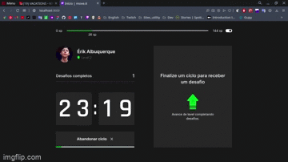

<p align="center">
   
</p>

<p align="center">Next Level Week - #NLW4 @Rocketseat</p>

## Features:  
 * Dark Theme 
 * Layout responsive

<div>
   
</div>

## Technologies
This project was made using the follow technologies:

* [Typescript](https://www.typescriptlang.org/)      
* [React](https://reactjs.org/)      
* [Next.js](https://nextjs.org/) 


# How to run
```bash
# Clone Repository
$ git clone https://github.com/erikalbuquerque/move-it.git
```

### 💻 Run Web Project

```bash
# Install Dependencies
$ yarn install

# Run Aplication
$ yarn dev
```
Go to http://localhost:3000/ to see the result.
